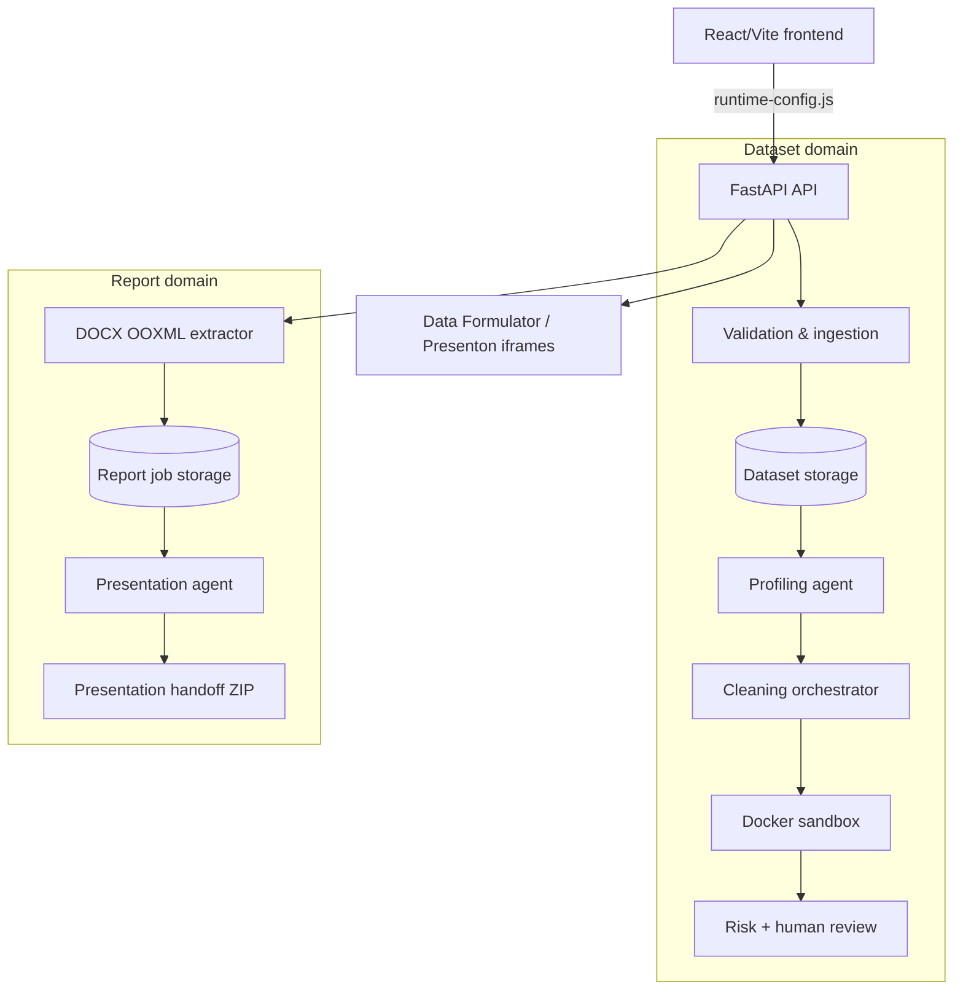
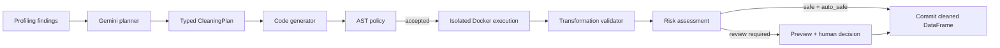

# InsightFlow AI

<p align="center">
  <a href="https://fastapi.tiangolo.com/"></a>
  <a href="https://react.dev/"></a>
  <a href="https://google.github.io/adk-docs/"></a>
  <a href="https://www.docker.com/"></a>
</p>

> A local-first AI workspace for validating, profiling, and safely cleaning datasets, then turning Word reports into human-reviewed presentation plans.

InsightFlow AI combines a React workspace with a FastAPI backend, deterministic data tools, Google ADK/Gemini agents, isolated Docker execution, and a review-first workflow. Data Formulator and Presenton are available as independent tools; InsightFlow does not transfer files to them automatically.

<p align="center">
  
</p>

<p align="center"><em>High-level architecture of the InsightFlow AI platform and its independent Docker tools.</em></p>

## At a glance

| Area | What it does |
| --- | --- |
| **Dataset workflow** | Validates CSV, Excel, and JSON files, profiles data, and proposes reviewable cleaning operations. |
| **AI with safeguards** | Uses agents for analysis and planning; validates generated cleaning code and runs it in an isolated, no-network Docker sandbox. |
| **Word → Slides** | Extracts content and original assets from DOCX files, then prepares a source-grounded presentation plan and ZIP handoff. |
| **External tools** | Provides user-controlled Data Formulator and Presenton workspaces as separate Docker services. |

## Contents

- [Why InsightFlow AI?](#why-insightflow-ai)
- [Product capabilities](#product-capabilities)
- [Architecture](#architecture)
- [Agent architecture](#agent-architecture)
- [Security model](#security-model)
- [Technology stack](#technology-stack)
- [Quick start for Windows](#quick-start-for-windows)
- [Docker deployment](#production-docker-compose)
- [API routes](#key-api-routes)
- [Storage and traceability](#storage-and-traceability)
- [Testing](#testing)
- [Further documentation](#further-documentation)

## Why InsightFlow AI?

| Challenge | InsightFlow approach |
| --- | --- |
| Data arrives in mixed CSV, Excel, or JSON formats | Validate first, then persist a compatible DataFrame and a traceable report. |
| AI-generated transformations can be unsafe | Generate a constrained Pandas function, validate its AST, execute it in an isolated Docker container, and measure the result before anything is committed. |
| Automation needs a human decision point | Surface risk, samples, generated code, validation evidence, and per-issue conversations before approval. |
| Word reports lose context when converted to slides | Preserve original document order, tables, assets, captions, and provenance before the agent creates a presentation plan. |
| External tools should remain independent | Embed Data Formulator and Presenton as full-canvas Docker tools; no automatic transfer is performed. |

## Product capabilities

### Data quality workflow

1. **Upload & validate** CSV, XLSX/XLS, or JSON files.
2. **Profile** the persisted DataFrame with deterministic Pandas tools and an optional Google ADK/Gemini reasoning layer.
3. **Plan and preview** AI cleaning operations.
4. **Review, approve, dismiss, or discuss** each proposed transformation.
5. **Download** the verified cleaned dataset and its audit report.

### Word → Slides workflow

1. Upload a `.docx` file.
2. Deterministically extract ordered paragraphs, sections, tables, and original embedded assets.
3. Let the Presentation Agent suggest audience, objective, duration, slide count, and style.
4. Build and refine a validated, source-grounded presentation plan through chat.
5. Download a ZIP handoff containing the latest plan, prompt, source Word file, and selected original visuals.

### Workspace experience

- Light shadcn-inspired React/Vite dashboard with a collapsible sidebar.
- API and Gemini runtime status in the application header.
- Dedicated views for Validation, Profiling, AI Cleaning, and Word → Slides.
- Full-canvas, lazy-loaded iframes for Data Formulator and Presenton.

## Architecture

### Composition model

`backend/main.py` is the FastAPI composition root. It owns the original dataset routes and mounts the report/presentation routers without merging their domain logic. The result is one local API and workspace with **two deliberately separate business domains**.



### Repository map

```text
InsightFlow-AI-SHADCN-ADMIN/
├── backend/
│   ├── main.py                         # FastAPI composition root and dataset API
│   ├── services/
│   │   ├── validation/                 # File validation and ingestion
│   │   ├── datasets/                   # Dataset lifecycle and download/delete helpers
│   │   ├── profiling/                  # Deterministic toolkit + Google ADK profiler
│   │   ├── cleaning/                   # Plan, generation, sandbox, risk, review
│   │   └── report_presentation/        # DOCX extractor + Presentation Agent
│   ├── storage/                        # Runtime datasets, reports, and jobs (gitignored)
│   └── test_*.py                       # Technical, lifecycle, agent, and regression tests
├── frontend/
│   ├── src/                            # React shell, visual system, legacy DOM contract
│   ├── public/legacy/                  # Preserved legacy runtime scripts
│   └── package.json                    # React, Vite, Tailwind, TypeScript
├── docs/
│   ├── assets/
│   │   └── architecture-insightflow.png # README architecture diagram
│   └── *.md                             # Integration and lifecycle documentation
├── docker-compose.tools.yml            # Data Formulator + Presenton services
├── run.py                              # Production-like local launcher
├── run.bat                             # Windows launcher: build + start
└── run-dev.bat                         # Windows development launcher
```

## Agent architecture

InsightFlow uses LLMs for planning and reasoning—not as an unchecked execution environment.

| Agent | Responsibility | Grounding and guardrails | Fallback / human control |
| --- | --- | --- | --- |
| **Profiling Agent** | Investigates dataset structure and data-quality signals. | Google ADK agent with a deterministic Pandas toolkit, structured `ProfilingReport` output, and report sanitization against the actual DataFrame. | Falls back to a deterministic baseline profile when Gemini is absent or unavailable. |
| **Cleaning Planner** | Converts profiling findings into a structured `CleaningPlan`. | Uses bounded dataset context and typed plan items; semantic recommendations can remain non-executable. | Plan items become reviewable decisions, not silent mutations. |
| **Code Generator** | Creates one Pandas cleaning function for a selected plan item. | Required `clean_dataframe(df)` contract; AST policy rejects imports, I/O, networking, reflection, dangerous built-ins, and unsafe attributes. | Up to three controlled attempts; no code runs in FastAPI. |
| **Issue Resolution Agent** | Handles an individual unresolved issue in the cleaning conversation. | Works on the active issue, proposal, and dataset version; chat alone does not mutate data. | A user explicitly applies, dismisses, accepts, or reopens decisions. |
| **Presentation Agent** | Suggests presentation setup, selects grounded material, creates and refines a `PresentationPlan`. | Read-only extractor tools; validated source IDs; claims labeled as Fact, Interpretation, or Recommendation. | The user can edit the plan or chat before exporting the handoff package. |

### Profiling: deterministic tools first

The profiling agent operates over a Pandas toolkit for schema overview, missingness, duplicates, distributions, categorical analysis, outliers, correlations, pattern detection, and cross-column investigations. Gemini can orchestrate that analysis, but the saved report is schema-validated and reconciled against real data. If a Gemini key is missing, exhausted, or the SDK is unavailable, the deterministic profile remains available.

### Cleaning: plan → proof → decision



The transformation validator measures candidate changes against the original DataFrame: row/column scope, type stability, nulls, distributions, examples, and the targeted issue. A saved proposal is re-executed and revalidated before commit; DataFrame and code fingerprints prevent stale previews from being applied.

## Security model

The Docker sandbox—not the LLM—is the security boundary for generated cleaning code.

| Control | Current implementation |
| --- | --- |
| Code contract | Exactly one `clean_dataframe(df)` function; fixed copy-first and return-last contract. |
| Static policy | Python AST allow-list / deny-list, a 20 KB code limit, and a 2,500-node complexity limit. |
| Process isolation | A new ephemeral container for every attempt. |
| Network and privilege | `--network none`, dropped capabilities, `no-new-privileges`, unprivileged UID. |
| Filesystem | Read-only root, read-only input mount, bounded temporary output locations. |
| Resources | Memory, CPU, PID, file descriptor, file-size, stdout/stderr, and timeout limits. |
| Data transport | Structured JSON data transport; no sandbox-produced pickle is deserialized. |
| Cleanup | Containers are force-removed after every run, including failures and timeouts. |

The optional `agent_runtime` backend can use Google Agent Engine Code Execution, but Docker is the default local backend. Using the managed backend transfers code and data to Google Cloud; enable it only for data approved for that environment.

### DOCX security

The report extractor reads OOXML ZIP members directly rather than extracting arbitrary archive paths. It rejects unsafe paths, duplicate entries, malformed XML, DTDs, macro-enabled content types, and oversized archives. External relationships are never fetched. Original media bytes are preserved and checksummed; they are not recompressed or rewritten.

## Technology stack

| Layer | Tools |
| --- | --- |
| Frontend | React 18, TypeScript, Vite, Tailwind CSS, Radix Slot, Lucide React |
| API | FastAPI, Uvicorn, Pydantic Settings, `python-multipart` |
| Data | Pandas, NumPy, SciPy, OpenPyXL, xlrd |
| AI orchestration | Google ADK, Google GenAI / Gemini, key rotation with cooldown |
| Document extraction | `python-docx`, lxml, Pillow, direct OOXML inspection |
| Isolation | Docker with an unprivileged, no-network sandbox |
| External tools | Data Formulator and Presenton, each independently containerized |

## Quick start for Windows

### 1. Prerequisites

- Python 3.11+ recommended
- Node.js and npm
- Docker Desktop using Linux containers (required for generated cleaning execution)
- Optional: one or more Google AI Studio Gemini API keys

### 2. Create the backend environment

```powershell
python -m venv backend/venv
.\backend\venv\Scripts\python.exe -m pip install -r backend/requirements.txt
```

### 3. Configure InsightFlow — choose one mode

InsightFlow supports two equivalent configuration workflows. Use the UI for local administration, or an environment file for automation and deployment bootstrap. If both are used, the most recently saved UI value becomes the active local configuration.

#### Option A — UI-managed configuration (recommended)

Start InsightFlow with no `.env` file required. In the top-right header, select **Settings** and configure:

- one or more Gemini API keys, with masked consultation, individual test/replacement/removal, and a live validation test;
- the Gemini model and key cooldown;
- dataset, DOCX, expanded-ZIP, and ZIP-entry safety limits.

Saved keys are never displayed again: only masked labels are returned to the browser. Locally, UI-managed values are persisted automatically in `backend/.env`; users never need to open or edit it manually. In Docker Compose, the same values are persisted in the private `insightflow_settings` volume at `/app/config/insightflow.env`, never in the image.

#### Option B — environment-file configuration

For automation, CI, or infrastructure-managed local deployments, create the file yourself:

```powershell
Copy-Item backend/.env.example backend/.env
```

Edit `backend/.env` and add only local secrets and trusted administrator settings. Never commit it.

```dotenv
GEMINI_API_KEYS=first_key,second_key
GEMINI_MODEL=gemini-3.5-flash-lite
GEMINI_KEY_COOLDOWN_SECONDS=30
INSIGHTFLOW_ALLOWED_ORIGINS=http://localhost:3000
MAX_FILE_SIZE_MB=50
MAX_DOCX_SIZE_MB=25
MAX_UNCOMPRESSED_SIZE_MB=250
MAX_ZIP_ENTRIES=10000
```

`GEMINI_API_KEY` is supported as a single-key fallback. `GOOGLE_API_KEY` alone is intentionally not used as configuration input, avoiding accidental use of unrelated credentials.

For Docker Compose, use `docker-compose.env.yml` when infrastructure—not the UI—owns the values. It passes `backend/.env` to the API at startup and keeps it outside the image.

### 4. Build the cleaning sandbox once

```powershell
docker build -t cleaning-sandbox:1 backend/services/cleaning/executors
```

### 5. Start InsightFlow

```powershell
.\run.bat
```

The launcher builds the React frontend, serves it at [http://localhost:3000](http://localhost:3000), and starts FastAPI on the first available port between `8000` and `8020`. It prints the exact Swagger URL on startup.

For split development servers instead:

```powershell
.\run-dev.bat
```

This starts FastAPI on `http://127.0.0.1:8000` and Vite on `http://127.0.0.1:3000`.

## Optional external tools

Start both independent tools with Docker Compose:

```powershell
docker compose -f docker-compose.tools.yml up -d
```

| Tool | Default URL | Purpose |
| --- | --- | --- |
| Data Formulator | `http://localhost:5567` | Interactive data exploration |
| Presenton | `http://localhost:5001` | Presentation generation workspace |

Presenton's optional **Sign in with ChatGPT / Codex** connection also requires local port `1455`; the supplied Compose files publish it automatically. If a browser blocks the connection inside the embedded workspace, use **Open Presenton in a new tab** and complete the sign-in at `http://localhost:5001`.

Override either address without rebuilding:

```powershell
$env:DATA_FORMULATOR_URL="https://data.example.com"
$env:PRESENTON_URL="https://slides.example.com"
python run.py
```

They are embedded for user-directed access only. Cleaned datasets and presentation handoff packages are **not** automatically transferred to external tools.

## Production Docker Compose

The root [docker-compose.yml](docker-compose.yml) builds and starts the complete local stack: FastAPI, the static frontend, the existing isolated cleaning sandbox, Data Formulator, and Presenton.

```powershell
docker compose build
docker compose up -d
docker compose ps
```

Open [http://localhost:3000](http://localhost:3000). The API is available at `http://localhost:8000`, Data Formulator at `http://localhost:5567`, and Presenton at `http://localhost:5001`.

By default, configure Gemini and import limits through the **Settings** interface. Docker keeps the UI-managed configuration and application data in named volumes, so `docker compose down` does not erase them. To remove all local application data intentionally, run `docker compose down -v`.

### Environment-managed Docker configuration

If CI, a secret manager, or an administrator owns the values instead, create `backend/.env` from the example and use the override file:

```powershell
Copy-Item backend/.env.example backend/.env
docker compose -f docker-compose.yml -f docker-compose.env.yml up -d --build
```

For a non-local deployment, set these values in the deployment environment before starting Compose:

```dotenv
INSIGHTFLOW_ALLOWED_ORIGINS=https://insightflow.example.com
API_BASE_URL=https://api.insightflow.example.com
DATA_FORMULATOR_URL=https://data.insightflow.example.com
PRESENTON_URL=https://slides.insightflow.example.com
```

`API_BASE_URL`, `DATA_FORMULATOR_URL`, and `PRESENTON_URL` are browser-facing URLs; do not set them to internal Docker service names. For a ready-made HTTPS deployment, use the dedicated production Compose file below instead of publishing the development ports directly.

If you change `FRONTEND_PORT` from its default `3000`, include its full browser origin in `INSIGHTFLOW_ALLOWED_ORIGINS` as well.

### Public HTTPS deployment

For an internet-facing server, use one DNS name per browser service. In particular, Presenton must be served from its own root domain such as `slides.example.com`; serving it below `/presenton` is not supported because its frontend uses root-relative routes. This also makes OAuth/chat-provider login and browser cookies reliable.

1. Point these four DNS records to the Docker host: `app`, `api`, `data`, and `slides`.
2. Copy [production.env.example](production.env.example) to `.env.production`, then replace every example domain and email. Use a secret manager instead when your deployment platform provides one.
3. Ensure ports **80** and **443** reach the host, then start:

```powershell
docker compose --env-file .env.production -f docker-compose.production.yml up -d --build
docker compose --env-file .env.production -f docker-compose.production.yml ps
```

Caddy obtains and renews TLS certificates automatically. The API and Data Formulator remain on the private Docker network; Presenton also publishes port `1455` only for its optional ChatGPT / Codex callback. Restrict that callback port at the host firewall when your deployment needs it. The frontend receives public HTTPS URLs at runtime, so it never asks a remote user’s browser to contact `localhost`.

For local Docker development, continue using `docker compose up -d --build` and open it in installed Chrome or Edge. The Codex in-app browser is intentionally isolated from local machine ports, so it is not a valid test of `localhost` services.

### Docker security note

The existing cleaning architecture creates a short-lived, no-network Docker container for each generated transformation. Therefore the API service needs access to `/var/run/docker.sock`. Treat the host as trusted, do not expose the API directly to untrusted networks, and use a dedicated host or a Docker-socket proxy when deploying outside a controlled environment.

## GitHub readiness

- `.env`, local storage, generated reports, frontend build output, and private-key file extensions are ignored by Git.
- [CI](.github/workflows/ci.yml) compiles backend modules, runs deterministic validation tests, builds the frontend, and builds the production Docker images on pushes and pull requests to `main`.
- [SECURITY.md](SECURITY.md) documents private vulnerability reporting and files that must never be committed.
- Before publishing, create the GitHub repository, verify `git status`, and confirm that no local `.env` or runtime storage is staged.

## Key API routes

FastAPI’s live contract is available from `/docs`. The primary routes are:

| Area | Routes |
| --- | --- |
| Dataset ingestion | `POST /upload`, `GET /files`, `GET /files/{type}/{stem}`, `DELETE /files/{type}/{stem}` |
| Validation | `GET /validations/{type}/{stem}`, `POST /validate/{type}/{stem}` |
| Profiling | `POST /profile/{type}/{stem}`, `GET /profiles/{type}/{stem}`, `GET /profiles` |
| Cleaning | `POST /clean/{type}/{stem}`, `GET /cleanings/{type}/{stem}`, `GET /cleanings/{type}/{stem}/download`, `POST /cleanings/{type}/{stem}/issues/message` |
| Runtime & local settings | `GET /health/gemini`, `GET /services/status`, `GET /settings/gemini`, `POST /settings/gemini/test`, `PUT /settings/gemini`, `POST /settings/gemini/keys/{index}/test`, `PUT /settings/gemini/keys/{index}`, `DELETE /settings/gemini/keys/{index}` |
| DOCX extraction | `POST /api/extract`, `GET /api/jobs/{job_id}`, `GET /api/jobs/{job_id}/assets/{filename}` |
| Presentation Agent | `/api/jobs/{job_id}/presentation/context`, `/suggest-setup`, `/plan`, `/chat`, `/conversation`, `/presenton-prompt`, `/download-package` |

## Storage and traceability

Dataset artifacts live below `backend/storage/` and are partitioned by format:

```text
storage/
├── uploads/            # Original accepted files
├── dataframes/         # Compatible persisted DataFrames
├── validations/        # Technical validation reports
├── profiles/           # Profiling reports
├── cleaning_reports/   # Cleaning plans, decisions, audit data
├── cleaned/            # Verified cleaned DataFrames
└── report_jobs/
    └── {job_id}/
        ├── source/report.docx
        ├── assets/
        ├── extraction.json
        └── presentation/
            ├── presentation_plan.json
            ├── presentation_conversation.json
            ├── presenton_prompt.txt
            └── presentation_handoff.zip
```

Deleting a dataset removes the artifacts that belong to that dataset. Report jobs use isolated UUID directories. No database is required for the current local-first architecture.

## Testing

The backend includes focused tests for technical validation, dataset lifecycle, profiling, cleaning regressions, cleaning proposals, generated-code integration, chat safety, report extraction, and presentation packaging.

```powershell
.\backend\venv\Scripts\python.exe -m pytest backend -v
```

Some integration tests require Docker because the cleaning workflow intentionally does not fall back to executing generated code in the FastAPI process.

## Design principles

1. **Validate before reasoning.** Bad input should never become trusted model context.
2. **Use AI for judgement, deterministic code for evidence.**
3. **Generated code must be constrained, isolated, measured, and reviewable.**
4. **Human decisions are explicit and version-aware.**
5. **Keep domains isolated.** Dataset quality and DOCX presentation planning share an app, not source data or business rules.
6. **External tools remain user-controlled.** InsightFlow prepares artifacts; it does not silently publish them elsewhere.

## Further documentation

- [Dataset lifecycle](docs/dataset-lifecycle.md)
- [Validation integration](docs/validation-integration.md)
- [Report and presentation integration](docs/report-presentation-integration.md)
- [External tools integration](docs/external-tools-integration.md)
- [Frontend logic-preservation contract](frontend/LOGIC-PRESERVATION.md)

---

Built as a local-first intelligence workspace for teams who want AI assistance with evidence, safeguards, and control.
